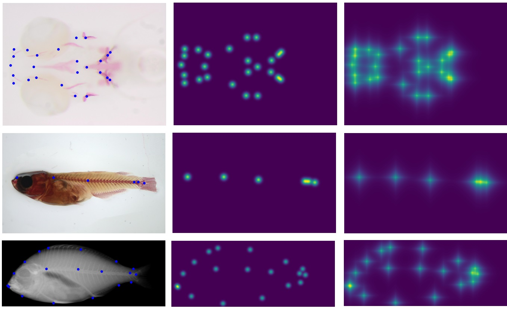

# Deep-Fish-Landmark-Prediction
**Description:** A Deep Learning based anatomical landmark prediction application for biomedical and Aquaculture Fish Species.<br>
**Paper:** DOI: [ECCV 2022 Conference Paper Link](https://doi.org/10.1007/978-3-031-25069-9_31)). <br>

**Abstract (short):**
This paper empirically evaluates deep learning methods for anatomical landmark detection in fish bioimages. It compares heatmap‑based regression against direct regression approaches using several CNN architectures. Experiments on multiple fish imaging datasets show that the heatmap method with exponential functions and a U‑Net architecture performs best. Datasets and code are made available publicly.

**Datasets:**

- Microscopy Images of Zebrafish Lavae (Model fish in biomedcial research):
- Microscopy Images of Medaka Fish (Another model fish in Biomedical research)
- Radiography (X-Rays) Images of Gilthead Seabream (Sparus aurata) (Aquaculture fish species)

**Methodology:**

- Direct Coordinate Regression
- Heatmap based Regression (Gaussian and Exponential Heatmaps)

**CNN Architectures:**
- UNet, HRNet, DeepLab (with transfer learning), FCN-8

<p align="center"> <br> <em>Figure 1: Example heatmap prediction</em> </p> <br>

**Citation:**
```bibtex
@inproceedings{kumar2022empirical,
  title={Empirical Evaluation of Deep Learning Approaches for Landmark Detection in Fish Bioimages},
  author={Kumar, Navdeep and Biagio, Claudia Di and Dellacqua, Zachary and Raman, Ratish and Martini, Arianna and Boglione, Clara and Muller, Marc and Geurts, Pierre and Mar{\'e}e, Rapha{\"e}l},
  booktitle={European Conference on Computer Vision},
  pages={470--486},
  year={2022},
  organization={Springer}
}


